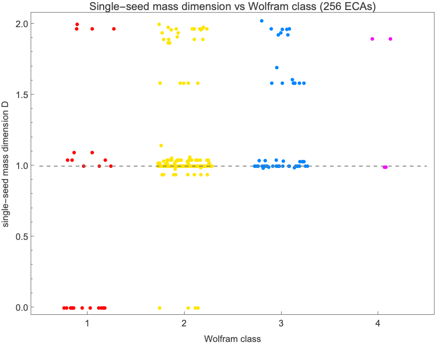
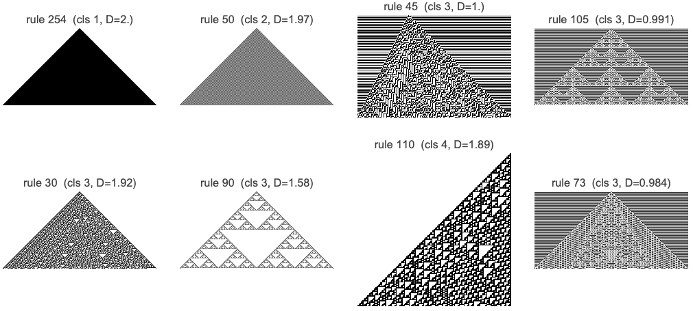

# Is single-seed mass dimension a proxy for Wolfram class?

**Research id:** mass-dimension-wolfram-class · **Domain:** cellular automata · **Date:** 2026-06-24

## Question
Across all 256 elementary cellular automata (ECAs), does the **single-seed mass
dimension** `D` (live cells in the first 2^k rows, slope of log₂mass vs log₂size;
`lib/massDimension.wl`) act as a proxy for the **Wolfram class** (1–4)? Report
the cleanest separators, the overlap regions, named outliers, and conclude
whether `D` alone is a usable classifier.

## Headline result
**No. Single-seed mass dimension cannot classify Wolfram class.** The best
possible single `D`-threshold separating the two large classes (2 vs 3) achieves
accuracy **0.776 — exactly equal to the majority-class baseline (0.776)**, i.e.
zero discriminative gain. Any *naive* threshold does *worse* than guessing:
`D ≥ 1.5` scores **0.732 < 0.776**. The reason is a dense, class-blind pile-up at
`D ≈ 1`: **76 % of class-2 and 69 % of class-3 rules** have `D ∈ [0.95, 1.05]`.

The dashed line is `D = 1`. Every class has a column of points sitting on it;
classes 2 and 3 each *also* reach `D ≈ 2`. The distributions are interleaved, not
banded.

## Method
- **`D`** = `massDimension[rule, 10]` for all 256 rules: single black cell on the
  rule's natural background, 2¹⁰ rows, slope of log₂(live-cell count) vs log₂(rows).
  `massDimension` is the asset validated in research 1 (log₂3 to 14 digits on rule 90).
- **Wolfram class** is canonically the *typical behavior from **random** initial
  conditions* — a different initial condition from the single seed `D` measures.
  There is no undisputed built-in per-rule class table, so class is assigned by a
  reproducible in-kernel classifier (`lib/wolframClass.wl`): perturb one cell of a
  random width-401 lattice and measure the **damage** (Hamming fraction of the
  difference pattern in late rows, max over 3 seeds) as the order/chaos
  discriminator, plus death/uniformity (→1), small temporal period (→2), and the
  canonical class-4 override `{110, 124, 137, 193}`.
- The classifier scores **27/27** on a literature-consensus anchor set (class-1
  `{0,8,32,128,160,255}`, class-2 `{1,2,4,12,72,108}`, class-3
  `{18,22,30,45,60,90,105,122,126,146,150}`, class-4 `{110,124,137,193}`).
- Class counts over all 256: **1 → 24, 2 → 177, 3 → 51, 4 → 4** (consistent with
  the known ECA statistic that most rules are class 2).

## What `D` does and does not separate
| class | min D | median D | max D | share at D≈1 |
|------:|------:|---------:|------:|-------------:|
| 1 | 0.00 | 0.50 | 2.00 | 0.25 |
| 2 | 0.00 | 1.00 | 2.00 | 0.76 |
| 3 | 0.98 | 1.00 | 2.02 | 0.69 |
| 4 | 0.99 | 1.44 | 1.90 | 0.50 |

- **Class 2 vs 3 — no separation.** Both medians are `1.00`; both span `1 → 2`.
- **The only faint signal** is monotone, not usable: Spearman ρ(D, class) over
  classes 1–3 is **0.378** (driven by class-1's dead seeds at `D ≈ 0` and a slight
  high-`D` skew in chaos). It yields no working threshold.
- **`D ≈ 0` (dead single seed)** is weakly class-1-ish but impure: of the 17 rules
  with `D < 0.1`, **12 are class 1 and 5 are class 2** — even total single-seed
  collapse does not pin the class.

## Named outliers (the interesting part)
**Class 1, yet maximal dimension.** Rules **254, 252, 250, 238** are class 1 (random
ICs relax to a homogeneous fixed point — the most trivial dynamics possible) yet
have the **highest single-seed `D ≈ 2.0`**. Rule **254** (Boolean OR) grows a *solid
black triangle* from one seed: `D = 2.000`, the maximum, with the most boring
long-term behavior. Dimension and dynamical complexity point in opposite directions.

**Class 2, ordered yet space-filling.** 26 class-2 rules have `D > 1.4` (e.g.
**50, 178, 94, 28, 70, 78**, several at `D ≈ 1.97`). They tile the single-seed light
cone with a *regular* texture — high dimension, no chaos.

**Class 3, chaotic yet `D ≈ 1`.** **35 of 51** class-3 rules have `D < 1.05`: from a
single seed they grow a one-dimensional sliver despite being chaotic on random ICs
(e.g. **45, 105, 73, 131, 184**). The single seed simply fails to excite the chaos.

## Mechanism behind the class-3 collapse (and a confound for `D`)
The "chaotic-yet-`D ≈ 1`" rules are **not** random — they are mostly a **rule-parity
artifact**. A rule with f(0,0,0)=1 (every **odd** rule number) flips an all-0
background, so a single seed evolves on a *blinking* background and `massDimension`
(which counts cells *differing from background*) measures only the deviation
region, which grows **linearly** → `D ≈ 1`.

- Of the 35 chaotic-yet-low-`D` rules, **32 are odd** (blinking background).
- **All 16** class-3 rules with `D ≥ 1.05` are **even** (stable 0-background).
- Class-3 mean `D`: **1.66 on even-background rules vs 1.01 on odd-background rules.**

So a large part of any apparent `D`–class signal is really `D` responding to
background parity, not to dynamical complexity. The only **genuine** even-background
chaotic-yet-`D ≈ 1` outliers are **rules 106, 120, 184** (184 = the "traffic" rule,
whose single seed is a thin particle stream).

## Refutation attempts
1. **Is the negative result a classifier artifact?** Re-labelled all 256 rules
   with a **disjoint random-seed set**: only **18/256** rules change class, all at
   the genuinely marginal 2↔3 boundary. The headline survives unchanged — under
   the alternate labeling the best 2-vs-3 threshold accuracy again equals the
   baseline (0.794 = 0.794).
2. **Finite-size artifact in `D`?** Re-computed `D` at 2⁹ vs 2¹⁰ rows for the
   borderline rules (45, 73, 105, 131, 254, 50, 30, 90): all stable to < 0.02. The
   `D ≈ 1` collapse is not a truncation effect.
3. **Trivial explanation, checked and *confirmed* as the mechanism.** The expected
   "single seed doesn't excite the rule" effect is real and quantified (35/51
   class-3 collapse), and further resolved into the background-parity confound above.
4. **`D > 2`?** A handful of space-filling rules read `D = 2.00–2.025`; the small
   overshoot past 2 is the additive `mass → mass∨1` guard plus triangle-vs-square
   geometry in the linear fit, not a super-2-dimensional pattern.

## Epistemic status
- **Verified (exhaustive, in-kernel over all 256 rules):** the `D` values; the
  per-class `D` distributions; best/naive threshold accuracies vs baseline; the
  35/51 collapse count; the odd/even-background split (32/35, 16/16, means
  1.66 vs 1.01); the named outlier lists.
- **Conjecture (proxy, validated on 27 anchors; tested over 256 rules):** the
  Wolfram-class labels themselves. They are an *operational* classifier, not
  Wolfram's hand classification. Class 3 vs 4 is **not** auto-separable (class 4
  is applied as a 4-rule override) — but this does not affect the headline, which
  concerns the large classes 2 and 3.
- **Speculation:** that the even-background outliers {106, 120, 184} are the most
  promising "genuinely dimension-deceptive" rules for a follow-up.

## Limitations / open questions
- `D` is single-seed; class is random-IC. The mismatch *is* the finding, but it
  also means this is not a test of "complexity ↔ dimension" under matched ICs.
  A natural follow-up: a **random-IC** spatial fractal/correlation dimension may
  track class far better (it would see the chaos the single seed hides).
- The class-3/4 boundary is left to the canonical override; a quantitative class-4
  detector (localized propagating structures) was out of scope.
- Single-seed `D` is **not** invariant under 0↔1 colour complementation (it changes
  the background), which is the root of the parity confound documented above.

## Conclusion
Single-seed mass dimension is **not** a usable proxy for Wolfram class. It fails
precisely where a classifier must succeed — separating ordered (class 2) from
chaotic (class 3) rules — collapsing both onto `D ≈ 1`, while a class-1 rule (254)
holds the maximal dimension. Much of its faint residual correlation is an artifact
of background parity rather than dynamics. A clean negative result, with rule
**254** (trivial dynamics, `D = 2`) and rules **106/120/184** (chaotic, `D ≈ 1`) as
the sharpest counterexamples.
