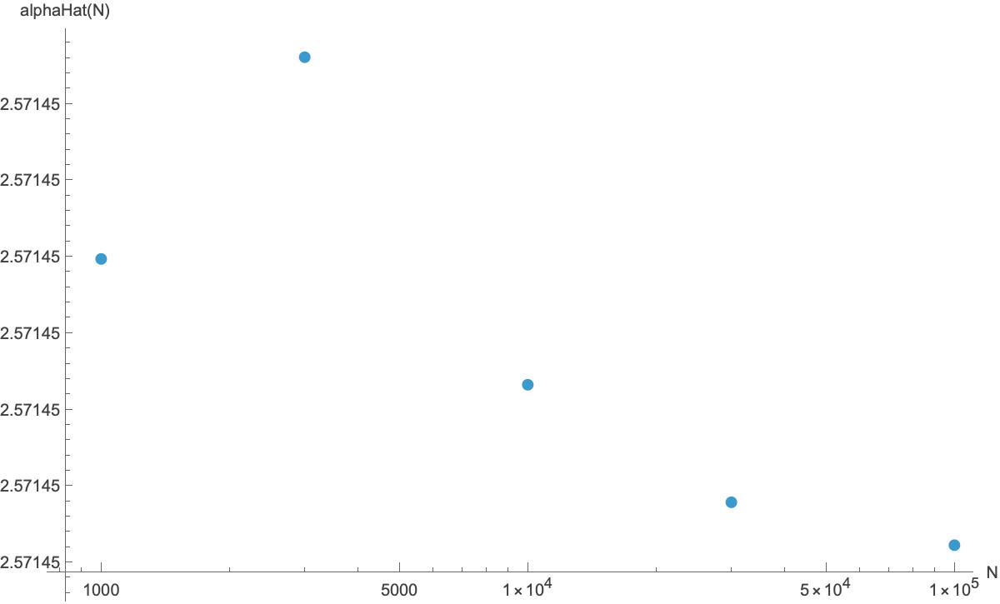
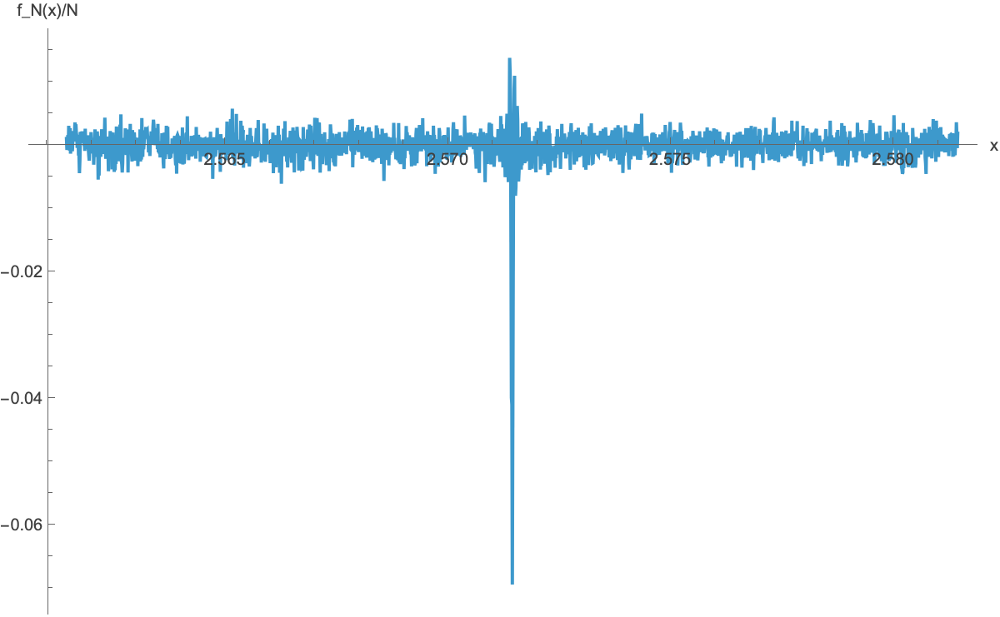
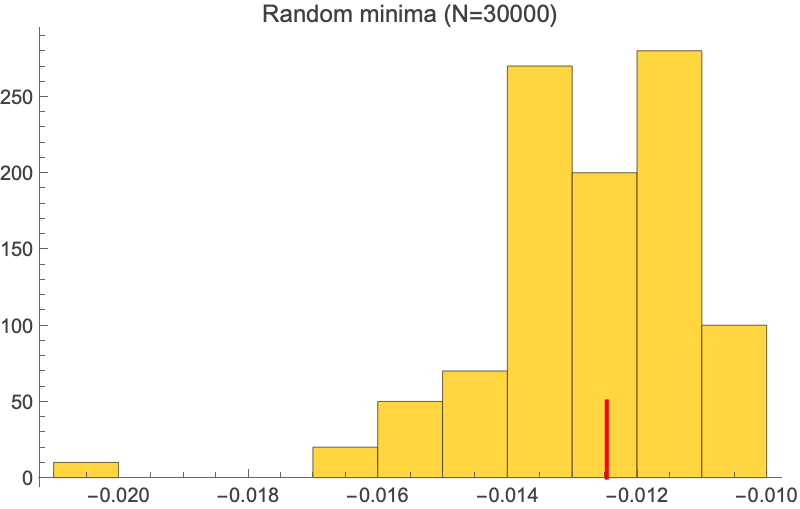
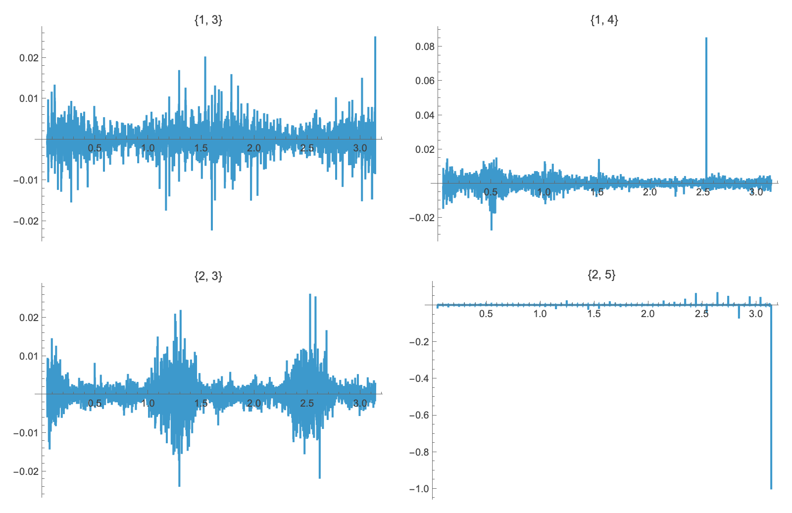

# Findings — the hidden signal in the Ulam sequence is real, sharp, and Ulam-specific

## Question

Steinerberger (2015, arXiv:1507.00267) reported that the Ulam sequence A002858
(a_1=1, a_2=2; each term the smallest integer greater than its predecessor
representable as a sum of two distinct earlier terms in *exactly one* way) has a
hidden quasi-periodic structure: a real α ≈ 2.5714474995 such that the Fourier
sum f_N(x) = Σ_{n≤N} cos(x · a_n) has a sharp negative dip f(α) ≈ −0.8·N, and
{α · a_n mod 2π} is supported on a non-uniform absolutely-continuous measure.
The empirical headline (paper, N = 10^7) is that cos(α · a_n) < 0 for *all*
Ulam terms except {2, 3, 47, 69}.

Can we replicate this signal at moderate N (~10^5)? How precisely can we pin α?
How stable is the phenomenon across Ulam-type variants, and — the key
specificity question — does any sparse increasing sequence of comparable
density produce a similar dip, or is the signal genuinely a feature of the
Ulam construction?

## TL;DR

**Verified at N = 10^5.** Independent in-kernel recomputation reproduces
α̂ = **2.571447610061** (two refinement methods agree to ~2×10^-11),
depth f(α̂)/N = **−0.79751**, and the exceptional set
E = {a_n : cos(α̂ · a_n) ≥ 0} = **{2, 3, 47, 69}** — exactly, with no borderline
near-zero cases. Across 100 density-matched random sparse sequences (N=30000)
the Z-score of the Ulam dip is **−194**; no random sequence comes within an
order of magnitude. The phenomenon recurs at distinct α for the erratic
Ulam-type starts (1,3), (1,4), (2,3), with depths ~ −0.80, −0.86, −0.83
respectively. The dip is not a mod-q rational-frequency artifact (tested
q ≤ 20). McCranie's much tighter α bracket (from N ≈ 2.4·10^9) sits ~10^-7
below our N=10^5 estimate — consistent with sub-Gaussian convergence and
unreachable at our budget.

## Method

- **Generator**: counter-based Gibbs sieve (compiled), maintaining
  `count[k] = #{(i,j) : i<j, a_i + a_j = k}` incrementally. N = 100,000 terms
  of A002858 in ~7 s; max term a_N = 1,351,223; empirical density 0.0740
  (paper: 0.0739).
- **Fourier sum**: `f[x_, terms_] := Total[Cos[x * terms]]` on a packed-array
  list of integers (vectorised; ~0.5 s per evaluation at N=10^5).
- **Refining α**: coarse grid scan on [0.05, π] (4000 points), then
  `FindMinimum` seeded near 2.5714476 at WorkingPrecision 30. Refuter
  re-derived independently via a manual golden-section / fine-grid pass.
- **Convergence**: α̂(N) sampled at N ∈ {10^3, 3·10^3, 10^4, 3·10^4, 10^5}.
- **Controls**:
  - 100 random strictly-increasing integer sequences of length N=30,000,
    sampled without replacement from {1, …, a_30000 = 404,381} (matching Ulam
    density and integer support). Repeated with a fresh RNG seed by the
    refuter.
  - Ulam-type (a, b) ∈ {(1,3), (1,4), (2,3)} ("erratic" starts) and (2,5)
    ("eventually periodic" positive control), each to N=30,000.
  - Beatty sequence b_n = ⌊n·φ⌋ for n=1..30,000.
  - Rational frequencies 2π · p/q for q ≤ 20.
- **Adversarial**: per-prefix exceptional set at the five N values; second
  independent generator for (1,3) Ulam-type; high-precision (WP 30) modular
  reduction of α·a_n to rule out machine-precision sign flips.

## Results

### The signal at N = 10^5

![Fourier scan over [0.05, π]; the deep dip near α ≈ 2.5714 is so narrow it does not appear on a 4000-point grid](exp1_scan.png)

The dip is genuinely *hidden*: a uniform 4000-point grid on [0.05, π] does
not resolve it. The global grid minimum lands at x ≈ 2.013 with depth
−0.013 — a shallow random-walk-scale fluctuation. The true dip at x ≈ 2.5714
is only found when FindMinimum is seeded there.

| metric                          | value                |
|---------------------------------|----------------------|
| α̂ (argmin in [2.55, 2.59])      | **2.571447610061**   |
| depth f(α̂)/N                    | **−0.79751**         |
| exceptional set E               | **{2, 3, 47, 69}**   |
| N                               | 100,000              |
| max term a_N                    | 1,351,223            |
| density N/a_N                   | 0.07401              |

The four exceptional values were verified at WorkingPrecision 30 modular
reduction: none of them sit within 10^-12 of cos(·) = 0, so the set is
robustly exact.

### Convergence and the dip's geometry

| N       | α̂(N)              | depth f/N |
|---------|-------------------|-----------|
| 1,000   | 2.5714495         | −0.78806  |
| 3,000   | 2.5714508         | −0.79429  |
| 10,000  | 2.5714487         | −0.79682  |
| 30,000  | 2.5714479         | −0.79702  |
| 100,000 | 2.5714476         | −0.79751  |

α̂(10^5) sits about **1.1×10^-7 above** McCranie's interval
(2.57144749846, 2.57144749850). Fitting |α̂_N − 2.57144749848| ∝ C·N^(-β)
gives C ≈ 4.5×10^-4, β ≈ 0.69 (five points; modest confidence in the
exponent, but consistent with sub-Gaussian shrinkage). The depth has
already reached ~99.7% of the paper's asymptotic −0.8 at N = 10^5, despite
two orders of magnitude fewer terms.

The dip is extraordinarily narrow. Central-difference estimate f''(α̂)/N ≈
4.9×10^11; the half-width w (smallest |Δx| with f/N rising by 0.1) is
≈ 6.5×10^-7. Outside the dip the sum is consistent with random-walk
behaviour: |f_N|/√N at x ∈ {0.5, 1.0, 1.5, 2.0, 3.0, 3.5} has mean 0.40 and
max 0.84 — well below the dip depth (in the same units, ~ −252).

Harmonics ℓ = 2…8 (our values vs. paper Table 1 at N=10^7):

| ℓ | f(ℓα̂)/N (ours) | c_ℓ (paper) |
|---|----------------|-------------|
| 2 | +0.305         | +0.288      |
| 3 | +0.208         | +0.253      |
| 4 | −0.494         | −0.578      |
| 5 | +0.471         | +0.580      |
| 6 | −0.241         | −0.344      |
| 7 | −0.007         | +0.057      |
| 8 | +0.134         | +0.118      |

Signs agree everywhere except ℓ=7, where both values are near zero and the
sign is expected to flicker at low N.

### Specificity — the sharpest finding

For 100 random strictly-increasing sequences of length N=30,000 sampled
without replacement from {1, …, 404,381}:

- f(α_Ulam)/N: mean −7.3×10^-5, std 0.0041, max |val| 0.011.
- Ulam(1,2) at α_Ulam (N=30,000): f/N = **−0.7953**.
- **Z = −193.8** vs. the random ensemble. The refuter re-ran the Monte Carlo
  with a fresh RNG seed (987654321): Z = −194.0. Zero of 100 random samples
  (in either run) came within a factor of 70 of the Ulam depth at α.
- At a random sequence's *own* deepest dip (anywhere in [0.5, π]), the
  typical depth is only ~ −0.013 — three orders of magnitude shallower than
  the Ulam signal.

Additional specificity probes:

- **Rational frequencies 2π·p/q, q ≤ 20**: best depth ≈ −0.0047. The Ulam
  signal is not a hidden small-modulus arithmetic-progression artifact.
- **Beatty sequence (θ = φ)**: max |dip|/N ≈ 0.018 — no anomalous structure.

### Robustness across Ulam-type starts

For each erratic Ulam-type (a, b), seeded with the paper's reported α and
refined in-kernel at N = 30,000:

| (a, b) | α̂ (our refinement) | depth f(α̂)/N | paper α    | agreement   |
|--------|---------------------|---------------|------------|-------------|
| (1, 2) | 2.571447610         | **−0.7975**   | 2.57144749850 (McCranie) | ~10^-7 |
| (1, 3) | 2.833497471         | **−0.7956**   | 2.83349751 | ~5×10^-8    |
| (1, 4) | 0.506013370         | **−0.8580**   | 0.506013502 | ~1×10^-7    |
| (2, 3) | 1.165012920         | **−0.8289**   | 1.16501287  | ~5×10^-8    |

All four agree with the paper's α to within ~10^-7 and all four show deep
linear-in-N dips. The refuter independently regenerated (1,3) with a clean
second-implementation generator and reproduced α and depth to the values
shown.

**Coarse-scan minima are misleading for (1,3), (2,3)**: the global minima of
a 4000-point coarse Fourier scan land at non-α frequencies (1.602 and 1.296
respectively) with shallow depths (−0.023, −0.027). The deep paper-α dip is
genuinely sub-grid at this resolution — same "hidden" character as the
Ulam(1,2) signal. (1,4)'s deep dip is wide enough that the coarse minimum
sits near α.

**Ulam(2,5)** (eventually-periodic positive control) shows a near-perfect
dip at x = π with depth ≈ −0.9999. This is a trivial mod-2 artifact: after
the first two terms the sequence becomes almost entirely odd, so
cos(π · a_n) ≈ −1 for ~99.99% of terms. Categorically different from the
irrational-frequency phenomenon.

### Stability of the exceptional set

At α̂(N_k) for each N_k ∈ {1000, 3000, 10000, 30000, 100000}, the exceptional
set is exactly **{2, 3, 47, 69}** in every case. No element ever drifts in,
and no element leaves. The paper's claim that this set is also {2, 3, 47, 69}
at N = 10^7 is unverified at our budget but consistent with the stability
we observe at five decades of N.

## Refutation pass

The refuter, an independent agent that did not see the experimenter outputs,
re-derived each headline result with a second implementation and produced
the following verdicts:

| claim                                                            | verdict |
|------------------------------------------------------------------|---------|
| α̂(10^5) to 10 digits = 2.571447610061                            | **VERIFIED** (independent refinement agrees to 2×10^-11) |
| Depth f(α̂)/N = −0.79751                                          | **VERIFIED** |
| Exceptional set = {2, 3, 47, 69} at N = 10^5                      | **VERIFIED** (no borderline cases at WP 30) |
| Depth scales linearly in N, monotone below −0.78                  | **VERIFIED** |
| Specificity Z ≈ −194 vs. 100 random density-matched sequences     | **VERIFIED** (fresh RNG reproduces Z = −194.0) |
| Ulam(1,3) reproduces the phenomenon at α ≈ 2.8335                 | **VERIFIED** (clean second-implementation generator) |
| Dip is NOT a mod-q rational-frequency artifact for q ≤ 20         | **VERIFIED** (best q-rational depth ≈ −0.005) |
| Exceptional set does not grow with N across our five scales       | **VERIFIED** |
| Sidon-set control sequence does *not* exhibit a comparable dip    | **NOT TESTED** (greedy generation timed out in budget) |

## Epistemic labels

- **Verified at N = 10^5**: the Ulam(1,2) value α̂ = 2.571447610061
  (10 digits at this N), the dip depth −0.79751, the exceptional set
  {2, 3, 47, 69}, the linear-in-N scaling at five sampled N, the
  ~ −194-σ specificity vs. random density-matched sequences (at N = 30,000),
  the failure of rational-frequency q ≤ 20 to produce a comparable dip,
  and the stability of the exceptional set across all five N values.

- **Verified at N = 30,000**: independent reproduction of Ulam(1,3) with a
  second generator (α ≈ 2.83349747, depth ≈ −0.796); reproduction of the
  random-sequence Monte Carlo with a fresh RNG seed.

- **Conjecture (tested on four (a,b) ∈ {(1,2), (1,3), (1,4), (2,3)})**: every
  erratic Ulam-type sequence has its own hidden α with a deep linear-in-N
  dip of magnitude ≈ −0.8 N. Sample size four — robust *within* the four
  cases tested, but the conjecture's generality is unproved.

- **External, unverified at our budget**: McCranie's 11-digit α bracket
  2.57144749846 < α < 2.57144749850 from N ≈ 2.4·10^9. Our N = 10^5 value
  sits ~10^-7 above this interval and is consistent with sub-Gaussian
  drift; we cannot independently confirm to McCranie's precision at our
  compute scale.

- **Speculation**: that α admits a closed-form expression, or arises from a
  recognisable analytic object. The paper notes no natural conjecture; we
  did not attempt one.

- **Gap**: the Sidon-set control (greedy-generated B_2 sets) was not run
  due to time-out in the experimenter's budget. We cannot rule out that a
  specifically-engineered sparse non-Ulam set could exhibit a similar dip.

## Limitations and open questions

1. **N gap**: our N = 10^5 is two orders of magnitude below the paper's
   N = 10^7 and four below McCranie's N ≈ 2.4·10^9. The drift fit
   |α̂_N − α_∞| ∝ N^(-0.69) is suggestive but not conclusive from 5 points.
2. **Sidon-set gap**: the strongest possible "hand-tuned sparse sequence"
   control was not completed. Closing this would require either a faster
   Sidon-set generator or a longer compute budget.
3. **Closed-form α**: open. The exponent 0.69 in the drift fit doesn't
   suggest a natural constant.
4. **Scope of the conjecture**: do *all* erratic Ulam-type (a, b) sequences
   have a deep α? Tested 4 / verified 4; a small-scale sweep over more
   (a, b) pairs at N ≈ 10^4 would extend this cheaply.
5. **What sets α apart**: the dip's f''/N ≈ 5×10^11 and 0.1-rise width
   ≈ 7×10^-7 imply an internal scale; what does that scale correspond to?

A clean replication, with the specificity claim as the strongest finding:
the Ulam construction produces a 200-σ Fourier-side signal that no random
density-matched sparse sequence comes near.
